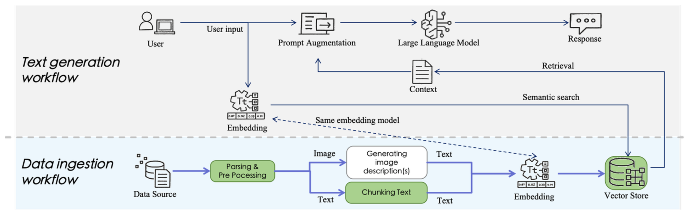

# 資料夾結構說明
- langgraph_react_agent - 使用 Langgraph 官方樣板改寫成 RAG Agent
- qdrant_insert_data.ipynb - 將文檔切塊、嵌入、insert 到向量資料庫
  
# 文檔素材
- [AWS 官方 EC2 文檔 PDF](https://docs.aws.amazon.com/zh_tw/AWSEC2/latest/UserGuide/concepts.html)
  
# RAG 檢索示範影片 （查詢 EC2 設定方式）

# RAG Agent 設定畫面

# 技術棧
- Python 3.11.11
- 編排框架 [LangChain / Langgraph](https://docs.langchain.com/oss/python/langgraph/overview)
- 向量資料庫 [Qdrant](https://qdrant.tech/)
  
# 測試模型
- Embedding 模型
    - 北京智源人工智能研究院 [BAAI/bge-m3](https://huggingface.co/BAAI/bge-m3)
    - 微軟 [Multilingual E5 Large](https://huggingface.co/intfloat/multilingual-e5-large)
    - Cohere [Cohere-embed-multilingual-v3.0](https://huggingface.co/Cohere/Cohere-embed-multilingual-v3.0)
    - Google [gemini-embedding-exp-03-07](https://developers.googleblog.com/en/gemini-embedding-text-model-now-available-gemini-api/)
- 大語言模型
    - [claude-3-5-sonnet](https://www.anthropic.com/news/claude-3-5-sonnet)

# 嵌入模型繁體中文排行
- 這個實作使用的嵌入模型，是參考針對繁體中文支援度高的前幾名進行 RAG 向量嵌入與檢索測試
- 參考資料：[ihower 使用繁體中文評測各家 Embedding 模型的檢索能力](https://ihower.tw/blog/12167-embedding-models)

# RAG 流程圖
在這個實作當中完整實作 RAG 兩大作業流程
- 檢索增強生成：
    > 提示詞輸入 ⭢ 提示詞嵌入 ⭢ 向量檢索 ⭢ 增強生成
- 資料攝取：
    > 解析原始文檔 ⭢ 文檔切塊 ⭢ 向量嵌入 ⭢ 向量資料庫

# 細節
- BAAI/bge-m3 嵌入模型使用「密集向量（語義相似度）」、「稀疏向量（關鍵字匹配）」達到混合檢索 hybrid search
- RAG 檢索精準度可以透過「metadata 過濾」的方式提高
    > 例如:
    > * 查詢「 EC2 設定方式」，在檢索時明確附加條件，只檢索與 EC2 相關文檔，過濾其他文檔分塊，不要查詢 Lambda 文檔 
    > * 提供 LLM 與使用者提問更精準匹配的資訊
- multilingual-e5-large 輸入的 tokens 上限只有 512
    > 因此文件分塊不能過大，容易維度 out of range 造成分塊失敗
- BAAI/bge-m3、multilingual-e5-large 因為開源使用 Huggingface 直接下載模型做向量嵌入
- Cohere-embed-multilingual-v3.0 使用 AWS Bedrock 平台
- gemini-embedding-exp-03-07
    > 因有每日免費 token 額度方便測試比較

# 測試評估
- BAAI/bge-m3 使用混合檢索，在部分情境中（提問含有大量關鍵術語），檢索精準度稍高
    > 因屬於小範圍測試集，在大量測試集下是否維持精準度，需要更多的評估測試
    > 這個實作目的在於完整實踐一遍整個 RAG 流程，因此不深入測試
- Cohere-embed-multilingual-v3.0、multilingual-e5-large
    > 小資料集實測精準度差異不大
- gemini-embedding-exp-03-07
    > 因對中文支援不在排行榜，精準度實測後相較稍低

